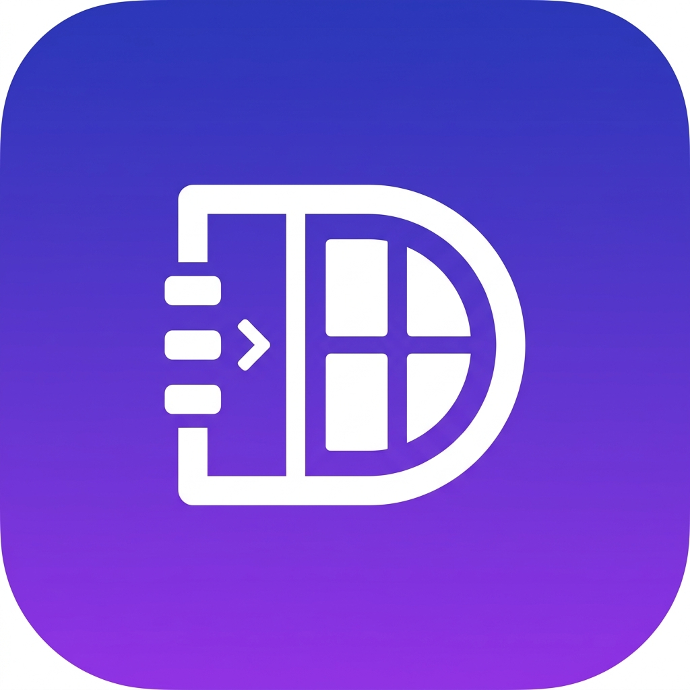

# DevDash

DevDash is a unified desktop dashboard for managing all your Node.js, React, and TypeScript projects. It operates as a local Electron application that lives in your system tray, allowing you to import projects, view available scripts, start/stop local development servers, and stream real-time terminal outputs in a clean, professional, and dynamic dark-mode interface.



## Features

- **Desktop Native App**: Runs seamlessly in the background and lives in your system tray for quick access.
- **Project Management**: Add any Node/JS/TS projects by their local path.
- **Auto-Discovery**: Automatically parses `package.json` to extract scripts and dependency counts.
- **Process Management**: Start, stop, and restart development servers (`dev`, `build`, etc.) with a single click.
- **Real-Time Terminal Logs**: Streams `stdout` and `stderr` directly into the UI via WebSockets.
- **Port Conflict Detection**: Automatically detects `EADDRINUSE` errors and offers a one-click "Kill Port" button to free up occupied ports.
- **Quick IDE Access**: Open any project directly in Visual Studio Code from the dashboard.
- **Git Integration**: View the current Git branch and uncommitted changes count.
- **Environment Editor**: View and edit `.env` files directly from the UI.

## Architecture

DevDash is a monolithic repository combining three main layers:
- **Electron**: Handles native OS interactions, system tray integration, and packaging.
- **Backend**: Node.js + Express + Socket.IO server that proxies commands and monitors child processes.
- **Frontend**: React + Vite single-page application tailored with modern, responsive CSS styling.

## Getting Started

### Prerequisites
- Node.js (v18+ recommended)
- npm

### Installation for Development
1. Clone this repository.
2. Install all dependencies from the root directory:
   ```bash
   npm install
   ```
   *(Note: This uses a `postinstall` hook to automatically install the `backend` and `frontend` dependencies).*

3. Run the application in development mode:
   ```bash
   npm run dev
   ```
   This command starts the Node.js backend, fires up the Vite frontend server, and launches the Electron wrapper seamlessly.

## Building for Production

DevDash can be compiled into a single-file `.exe` Portable App (no installation required) using `electron-builder`.

To build the executable:
```bash
npm run build
```

Once the build finishes, you will find `DevDash-Portable.exe` in the `release/` directory.

> **Note on Data Storage:**
> In production, your project configurations and data are safely persisted in your system's native AppData directory (e.g., `C:\Users\<User>\AppData\Roaming\devdash\data`).

## License
MIT License
